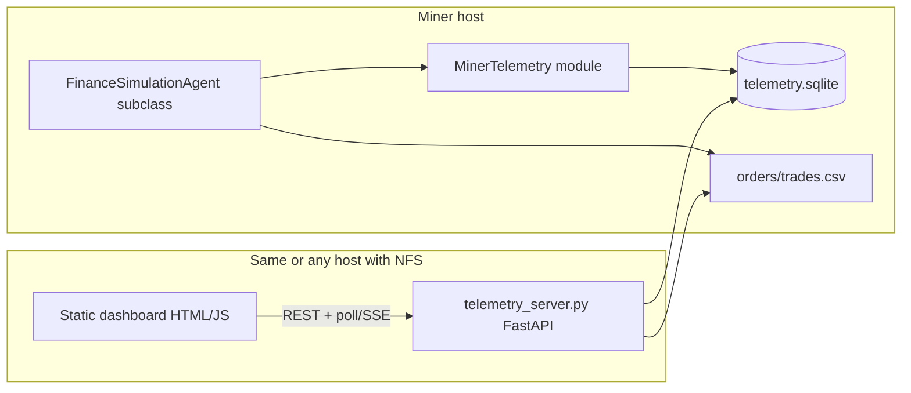

# Miner Dashboard Development Plan — Subnet 79

> Companion to `AGENT_DEVELOPMENT_PLAN.md`. That doc optimizes **validator
> score**; this doc optimizes **operator visibility** — why UID 189 churns,
> which books lose money, and whether signals match fills in real time.
>
> **Recommendation:** Build this. It pays for itself the first time you debug
> PnL/RT (your 189 row: ~0.31 QUOTE/RT vs top ~5–16) without tailing pm2 logs
> across 128 books.

---

## 1. Goals and non-goals

### Goals

- **One place** to watch every miner process: UID × validator × book.
- **TradingView-like layout:** price chart, summary cards, positions/orders table, recent trades.
- **Near real-time** (~1s refresh, matching sim publish interval).
- **History** across simulation restarts (per `simulation_id`).
- **Zero coupling to Grafana** — runs on the miner host, no validator credentials.
- **One import** for all agents — optional, off by default in production if I/O is a concern.

### Non-goals (v1)

- Replacing the official `dashboard.simulate.trading` scoring UI.
- Sub-millisecond latency or tick-by-tick L2 replay (validator already has L2 history tooling in `StateHistoryManager`).
- Multi-host fleet aggregation (v2: push to central TSDB).
- GenTRX training dashboards.

---

## 2. Opinion: CSV-only vs “one DB file per agent”

### What already exists (reuse, don’t reinvent)

`FinanceSimulationAgent` already appends event CSVs under:

```text
agents/data/{uid}/{validator_hotkey}/{simulation_id}/
  orders.csv
  trades.csv
  cancellations.csv
```

These are **append-only audit logs** — great for trade tables and post-mortems, **not** ideal as the sole chart feed (no mid/spread/signal per step, 128 books × 1 row per event = heavy joins).

### What we should add

A **telemetry layer** separate from validator event logs:

| Store | Role |
|-------|------|
| Existing `orders.csv` / `trades.csv` | Ground truth for fills; dashboard “Trades” tab |
| New **`telemetry.sqlite`** (WAL mode) per `(uid, validator, simulation_id)` | Time-series snapshots + agent decisions |
| Optional **`telemetry.ndjson`** mirror | Easy `tail -f` debugging; optional if SQLite is enough |

### Why not “one CSV per agent” for everything?

| Approach | Problem |
|----------|---------|
| Single `agent.csv` | 128 books × 1 Hz × days → huge file, rewrite pain, corrupt on crash mid-row |
| One CSV per book (128 files) | Fine for archive, awkward for cross-book dashboard queries |
| One SQLite per simulation run | **Sweet spot:** indexed queries, retention, atomic writes, one file to copy |

**Verdict:** **One SQLite file per `(uid, validator, simulation_id)`**, plus keep using existing event CSVs. Not one monolithic CSV per agent.

If you strongly prefer no SQLite: use **hourly rotated NDJSON**  
`telemetry/{uid}/{validator}/{sim_id}/snapshots-20260603-14.ndjson` — same schema, slightly more work in the dashboard reader.

---

## 3. Architecture overview



- **Write path:** agent process only (no network from agent).
- **Read path:** small read-only HTTP server scanning `TELEMETRY_ROOT`.
- **Frontend:** static files + [TradingView Lightweight Charts](https://github.com/tradingview/lightweight-charts) (MIT, ~45kb).

---

## 4. Data model

### 4.1 Directory layout

```text
${TELEMETRY_ROOT:-~/.taos/telemetry}/
  {uid}/
    {validator_hotkey_short}/          # first 8 chars or full hotkey slug
      {simulation_id}/
        telemetry.sqlite
        meta.json                        # agent class, params hash, started_at
        # symlinks or copies optional:
        # -> agents/data/{uid}/.../trades.csv
```

Environment variables (set in `run_miner.sh`):

- `TAOS_TELEMETRY_ROOT` — default `~/.taos/telemetry`
- `TAOS_TELEMETRY_ENABLED=1`
- `TAOS_TELEMETRY_SAMPLE_BOOKS=` — empty = all books; or `0,1,2` for dev

### 4.2 Table: `snapshots` (1 row per uid/validator/step/book)

Written once per `respond()` per book (or subsampled books in dev).

| Column | Type | Description |
|--------|------|-------------|
| `ts_ns` | INTEGER | Simulation timestamp (primary sort key) |
| `book_id` | INTEGER | 0..127 |
| `mid` | REAL | Mid price |
| `bid` | REAL | Best bid |
| `ask` | REAL | Best ask |
| `spread_bps` | REAL | Optional |
| `pos_qty` | REAL | Agent-reported signed BASE position |
| `pos_avg` | REAL | Entry average |
| `unrealized_pnl` | REAL | QUOTE, from mid vs avg |
| `base_bal` | REAL | From `state.accounts` |
| `quote_bal` | REAL | From `state.accounts` |
| `signal_trend_bps` | REAL | Strategy-specific (nullable) |
| `signal_flow` | REAL | Nullable |
| `signal_imb` | REAL | Nullable |
| `action` | TEXT | `hold` / `enter_long` / `exit` / … |
| `volume_used` | REAL | Optional cumulative QUOTE vol estimator |

Index: `(book_id, ts_ns)`.

Retention: prune snapshots older than N sim-hours (config, default 48h sim time) on simulation end or daily cron.

### 4.3 Table: `round_trips` (agent-emitted or derived)

On position flat → insert one row (feeds PnL/RT debugging like your Grafana row).

| Column | Type |
|--------|------|
| `ts_close_ns` | INTEGER |
| `book_id` | INTEGER |
| `side` | TEXT |
| `qty` | REAL |
| `entry_avg` | REAL |
| `exit_avg` | REAL |
| `realized_pnl` | REAL |
| `hold_s` | REAL |
| `reason` | TEXT | `tp` / `sl` / `time` / `manual` |

### 4.4 Table: `agent_summary` (1 row per step, not per book)

Cheap fleet view: total open positions, instructions sent, loop latency ms.

### 4.5 Reuse existing CSVs

Dashboard **Trades** and **Orders** tabs read `trades.csv` / `orders.csv` directly — no duplicate write. Join in API by `bookId` + timestamp.

---

## 5. Python module: `taos.im.telemetry`

### 5.1 Public API (agents import this)

```python
from taos.im.telemetry import MinerTelemetry

# In initialize():
self.telemetry = MinerTelemetry.from_agent(self)

# In respond(), per book after logic:
self.telemetry.snapshot(
    state=state,
    book_id=book_id,
    mid=mid,
    position=pos,
    signals={"trend_bps": trend, "flow": flow, "imb": imb},
    action="enter_long",
)

# On round-trip close:
self.telemetry.round_trip(...)

# End of respond():
self.telemetry.flush()  # batched commit every step
```

### 5.2 Integration options (pick one for v1)

| Option | Pros | Cons |
|--------|------|------|
| **A. Mixin** `TelemetryFinanceAgent(FinanceSimulationAgent)` | Subclass once in your agents | Every agent file changes base class |
| **B. Hook in base `report()`** behind `config.telemetry_enabled` | Zero agent code if we extract signals via callback | Hard to get strategy-specific fields |
| **C. Decorator / manual calls** in each agent | Full control, minimal framework magic | Easy to forget in new agents |

**Recommended v1:** **B + C hybrid**

- Base class: if `TAOS_TELEMETRY_ENABLED`, write **market-only** snapshots (mid, balances, no signals) from `update()` for all books.
- Agents opt in to rich fields via `self.telemetry.snapshot(..., signals=...)`.

Default **off** in prod until benchmarked; your 189 churn case needs ~1 KB/step × 128 books ≈ 128 KB/s to SQLite batch — acceptable on SSD.

### 5.3 Implementation notes

- **Single writer thread** or `sqlite3` connection with `PRAGMA journal_mode=WAL`, `synchronous=NORMAL`.
- **Batch inserts** in one transaction per `respond()` (128 rows max).
- **Never raise** into trading path — wrap in try/except, log once per minute on failure.
- **Validator hotkey** + **simulation_id** from `state` (same as `simulation_output_dir`).

### 5.4 `meta.json` on simulation start

```json
{
  "uid": 189,
  "agent_class": "MomentumScalperAgent",
  "params": {"quote_notional": 1500, "tp_bps": 12},
  "wallet": "sn79",
  "hotkey": "sn79-1",
  "started_wall": "2026-06-03T12:00:00Z"
}
```

---

## 6. Read API: `dashboard/telemetry_server.py`

Minimal **FastAPI** (or stdlib `http.server` + precomputed JSON for v0).

| Endpoint | Returns |
|----------|---------|
| `GET /api/catalog` | List telemetry sessions (`uid`, `validator_id`, `simulation_id`) |
| `GET /api/miners` | Deprecated alias of `/api/catalog` |
| `GET /api/validators/{validator_id}/agents/{uid}/simulations/{simulation_id}/books/{book_id}/summary` | Latest snapshot + card metrics for one book |
| `GET /api/validators/.../books/{book_id}/mid` | Mid price series + trade markers (`resolution`, `limit` query) |
| `GET /api/validators/.../books/{book_id}/snapshots` | Signal series for one book |
| `GET /api/validators/.../books/{book_id}/round_trips` | Round-trip table for one book |
| `GET /api/validators/.../books/{book_id}/trades` | Market orders for one book |
| `GET /events/stream?uid=` | **SSE** optional v1.1 — push on file mtime change |

CORS enabled for local dev. Bind `127.0.0.1:8787` by default.

---

## 7. Frontend layout (`dashboard/web/`)

Static SPA (no React required; vanilla JS or petite-vue).

```
+------------------------------------------------------------------+
|  UID [189 v]  Validator [xxx v]  Sim [20260528_1007 v]  Book [0] |
+------------------------------------------------------------------+
|  Cards: Mid | Spread | Pos | uPnL | RT today | PnL/RT | Activity*|
|         (*optional manual score import later)                     |
+------------------------------------------------------------------+
|                                                                   |
|              Lightweight Charts — candle or line (mid)            |
|              overlays: entry/exit markers from round_trips          |
|                                                                   |
+------------------------------------------------------------------+
|  Tabs: [Positions] [Round trips] [Trades] [Orders] [Signals]     |
|  sortable/filterable tables (book_id, time, pnl, reason)          |
+------------------------------------------------------------------+
```

**Chart feed:** resample `snapshots.mid` to OHLCV buckets (1s native, 5s/1m selectable).

**Markers:** `round_trips` + `trades.csv` taker/maker side.

**Signals panel:** sparkline of `signal_trend_bps`, `signal_imb` under chart (secondary scale).

**Multi-book:** book dropdown; optional heatmap grid (128 mini sparklines) in v2.

---

## 8. Phased delivery

### Phase 0 — Spike (0.5 day)

- [ ] `MinerTelemetry` writes 10 fake rows; `telemetry_server` returns JSON.
- [ ] One HTML page plots mid with lightweight-charts.

### Phase 1 — Core pipeline (2–3 days)

- [ ] `taos/im/telemetry/` package (`recorder.py`, `schema.py`, `paths.py`)
- [ ] Wire env vars in `run_miner.sh` (`-E TAOS_TELEMETRY_ENABLED=1`)
- [ ] Instrument `MomentumScalperAgent` (signals + round_trips)
- [ ] FastAPI read server + static UI (chart + trades table + cards)
- [ ] README section: “Local miner dashboard”

### Phase 2 — All agents + ergonomics (1–2 days)

- [ ] `TelemetryFinanceAgent` mixin or base hook for market-only snapshots
- [ ] MeanReversion / AdaptiveMaker signal fields
- [ ] Book heatmap, PnL/RT rolling card matching your Grafana math
- [ ] Retention + `prune_old_snapshots()`
- [ ] `dashboard/start.sh` — launches API + opens browser

### Phase 3 — Fleet (optional)

- [ ] rsync telemetry to one host; multi-UID selector
- [ ] Compare two UIDs side-by-side (A/B params)
- [ ] Export CSV/Parquet for notebook analysis

---

## 9. `run_miner.sh` integration

```bash
export TAOS_TELEMETRY_ROOT="${TAOS_TELEMETRY_ROOT:-$HOME/.taos/telemetry}"
export TAOS_TELEMETRY_ENABLED="${TAOS_TELEMETRY_ENABLED:-1}"

# After miner starts (optional second pm2 app):
# pm2 start dashboard/start.sh --name taos-dashboard
```

Keep telemetry on the **same machine** as the miner to avoid NFS latency on every step.

---

## 10. Performance and disk

| Load | Estimate |
|------|----------|
| Rows per second | 128 books × 1 Hz = 128 rows/s |
| Row size | ~200 bytes → ~25 MB/h sim wall (if 1 sim sec ≈ 1 wall sec) |
| SQLite with 48h retention | ~1–2 GB per active UID/sim — fine |

Mitigations:

- `TAOS_TELEMETRY_SAMPLE_BOOKS=0,1,2,...` for dev.
- Store snapshots every **N** steps on quiet books (position flat + no action).
- Aggregate to 5s candles in DB after 24h sim time.

---

## 11. Mapping to your UID 189 debug questions

| Grafana symptom | Dashboard view |
|-----------------|----------------|
| PnL/RT ≈ 0.31 | **Round trips** tab: distribution of `realized_pnl` / hold time |
| Med Kappa3 low | **Signals vs outcome** — enter when `trend_bps` small? |
| High 24H RT | **Trades** count per book heatmap |
| Wrong order size | **Orders** tab qty vs `quote_notional` |
| Activity OK | **Positions** — flat frequency per book |

---

## 12. File checklist (new repo paths)

```text
taos/im/telemetry/
  __init__.py
  recorder.py          # MinerTelemetry
  schema.py            # CREATE TABLE + migrations
  paths.py             # TELEMETRY_ROOT resolution

dashboard/
  telemetry_server.py
  start.sh
  web/
    index.html
    app.js
    style.css

DASHBOARD_DEVELOPMENT_PLAN.md   # this file
```

**Tests:** `tests/test_telemetry_recorder.py` — temp dir, 100 snapshots, query OHLCV.

---

## 13. Decision summary

| Question | Answer |
|----------|--------|
| Build it? | **Yes** — high value for tuning 189-style churn |
| One CSV per agent? | **No** — use SQLite per sim + existing event CSVs |
| Module for agents? | **Yes** — `taos.im.telemetry.MinerTelemetry` |
| Who writes? | Agent process (optional env flag) |
| Who reads? | Local FastAPI + static lightweight-charts UI |
| First instrumented agent? | `MomentumScalperAgent` (your production UID) |

---

## 14. Next step when you want implementation

1. Approve **SQLite + existing CSV** storage layout.
2. Implement **Phase 0–1** (`MinerTelemetry` + server + minimal UI).
3. Enable on **UID 189** pm2 process and validate one book chart vs pm2 logs.

No changes to validator protocol or scoring — purely operator-side observability.
